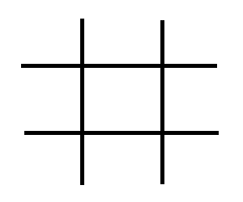
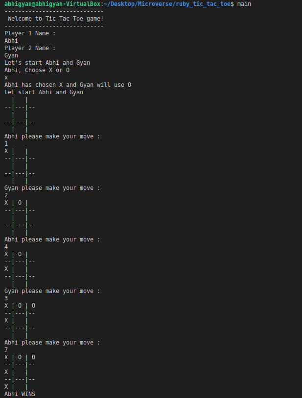

# ruby_tic_tac_toe

> In this project, we're required to create a Tic Tac Toe Game using Ruby with OOP concepts.

This project is split into 4 milestones, which are:

- Setting up the project
- Designing the user interface
- Creating the game logic
- Writing the game instructions

The main goal of this project is to ensure the mastery of the methods ruby provides and to learn how to replicate them using basic coding knowledge.

Below is a basic demonstration of how the tic tac toe game works



## Steps to play the game :

1. Find a friend to play with and run the program.
2. Player 1 is asked to choose between 'X' and 'O'. Player 2 is assigned the key not chosen by Player 1.
3. The selected player will be asked to input a number from 1 to 9 - each representing one field in the tic tac toe 3x3 grid.
4. Afterwards the other player will select the next field which will be marked by another symbol.
5. Selecting a field previously selected or inputting something besides an integer from 1 to 9 will not be accepted.
6. You will keep alternating until a winner is declared or the game ends in a draw.
7. First one to fill out a line with his three of his own symbols horizontally, vertically or diagonally wins!

### Prerequisites

Ruby installed locally

### How to start game

1. [Download](Clone the repository to your machine)

```sh
$ git clone https://github.com/Abhigyan001/ruby_tic_tac_toe
```

2. Navigate to the project folder and execute the "bin/main.exe" file.

3. Type in main in the terminal.

## Screenshot



## Built With

- Ruby

## Author

👤 **Abhigyan Mahanta**

- Github: [@Abhigyan001](https://github.com/Abhigyan001)
- Twitter: [@abhigyan_001](https://twitter.com/abhigyan_001)
- Linkedin: [Abhigyan Mahanta](https://www.linkedin.com/in/abhigyan-mahanta-b49799145/)

👤 **Sinework Amare Shiferaw**

- Github: [@sinework](https://github.com/sinework)

- LinkedIn: [LinkedIn](https://www.linkedin.com/in/sinework-amare-731a6a125/)

## 🤝 Contributing

Contributions, issues, and feature requests are welcome!

## Show your support

Give a ⭐️ if you like this project!

## Acknowledgments

- Microverse
- The Odin Project
- Github

## 📝 License

This project is [MIT](lic.url) licensed.
